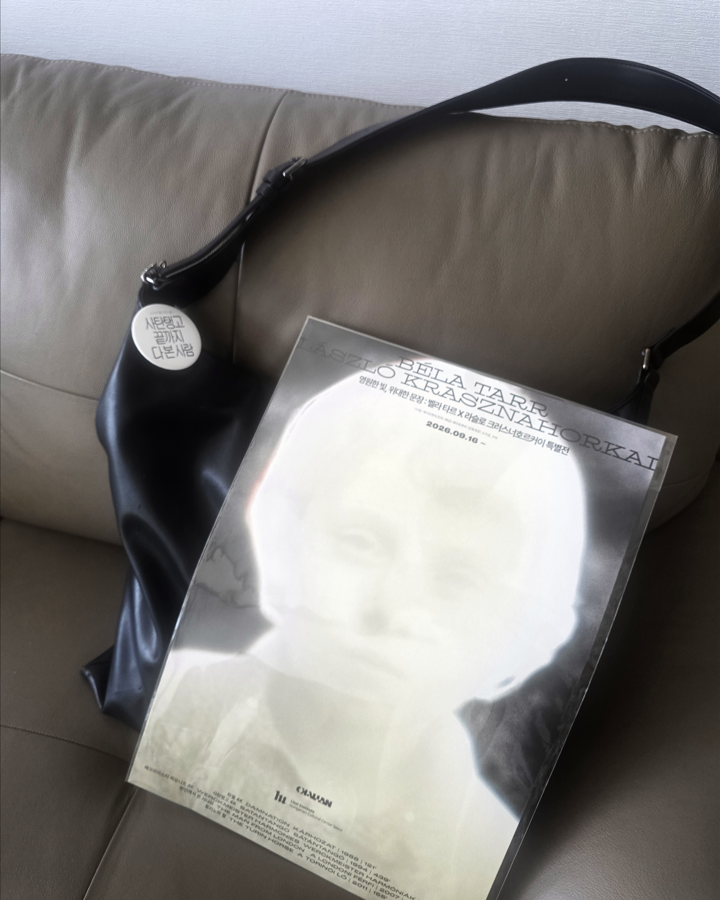
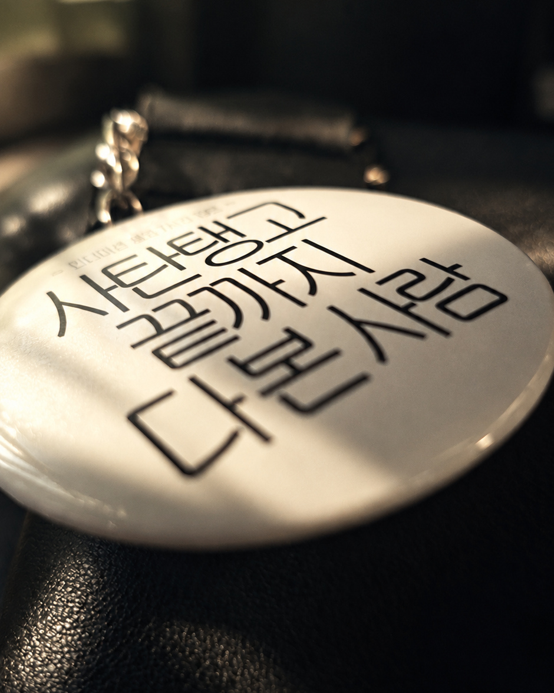
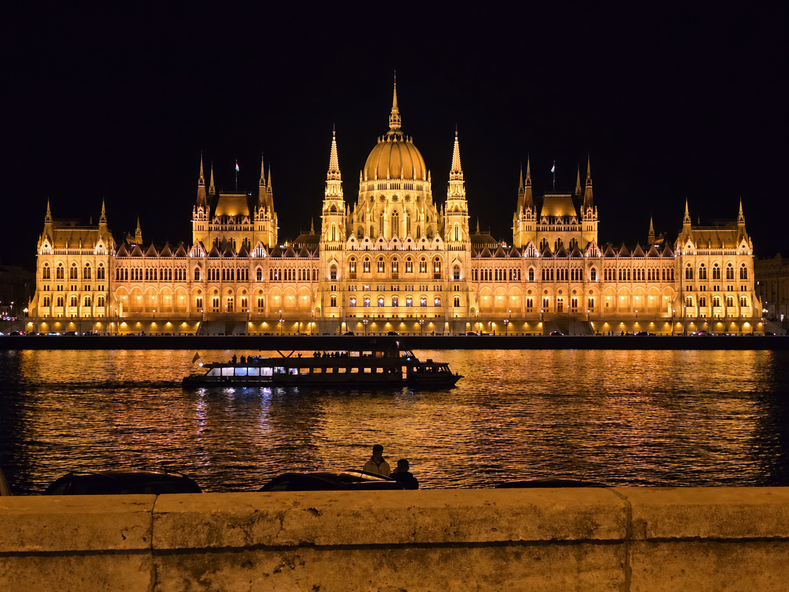
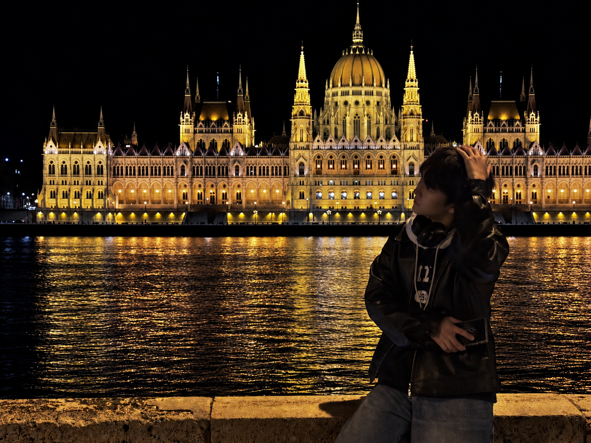
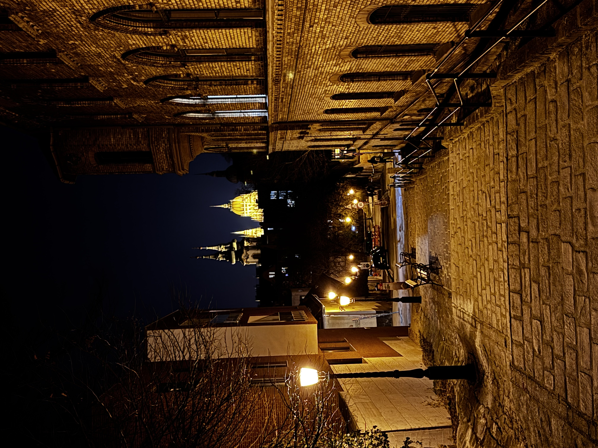
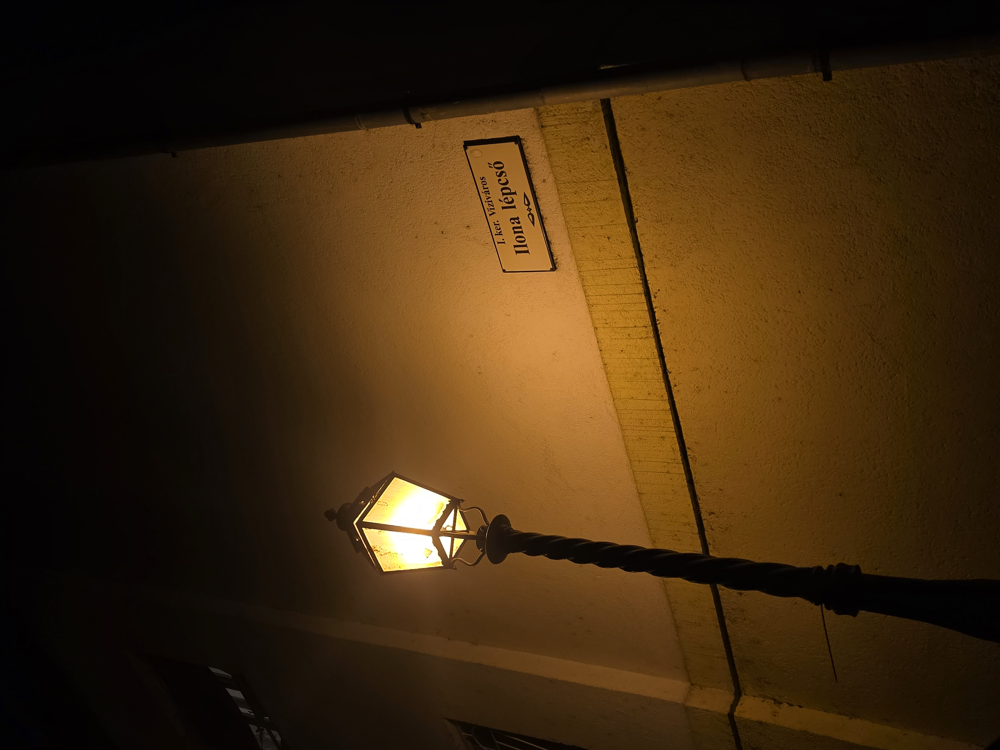

어떤 한 분야의 문외한이 그 분야를 정복하고자 할 때 가장 먼저 시도해 볼 수 있는 것은 그 분야의 저명한 수상작/수상자들을 확인하는 것입니다. 그렇기에 크러스너호르커이 라슬로라는 사람이 나와 이 지구에 함께 존재하고 있는 사람이구나, 2025년 10월에서야 깨달았습니다. 그는 2015년 맨부커상을 이미 수상한 작가이지만, 아쉽게도 문외한에겐 그 이력은 다소 심연의 한 줄처럼 보였던 것 같습니다. 

나무위키를 보며 그의 대표작 사탄탱고의 개요를 파악하는 것은 그리 어려운 일은 아니었습니다만, 그것을 원작으로 하여 만든 영화가 있다고 하니 그것 또한 알아보기 위해 새로운 페이지로 들어가 보았습니다. 벨라 타르 감독의 7시간짜리 영화. 당시에는 7시간짜리 영화에 어떤 대단한 것이 담겨있는지 꼭 봐야겠다, 뭐 그런 생각은 없었던 것 같습니다. 대신 그 7시간의 풀어헤침을 단 백 그램으로 조밀하게 짜내어 담고 있는 책에 대한 두려움이 앞서면서, 알라딘 장바구니에 담아두었던 그 책을 삭제했습니다.

  <figure>
    
    <figcaption>1. 남는 것 중 실제하는 것</figcaption>
  </figure>

  <figure>
    
    <figcaption>2. 가벼운 자랑거리는 될 것.</figcaption>
  </figure>

헝가리 여행은 비교적 슴슴한 맛이었던 것 같습니다.

특정 사건이나 시기의 기억들만을 선택적으로 잊는 것은 쉽지 않습니다. 우리 뇌는 어떤 것을 잊고자 할 때 무엇을 잊고자 하는지보다 잊고자 하는 의지에 초점을 맞춥니다. 아쉽게도, 그 과정에서 유럽 여행에서의 사소하거나 거대하게 행복하고 진취적이었던 여러 기억들은 상당 부분 소실되는 듯합니다.
그렇기에 기억이 더 탁해지기 전에 빨리 국가별로 여행의 세부 사항들을 정리하고 싶습니다만, 시간이 날 지는 모르겠습니다. 헝가리편의 트리거가 돼 준 이 작품에게 다시 한 번 감사해야 할 것 같습니다.

사진이 유일한 단서입니다. 사실 헝가리에서 우리는 관광에 그리 열성적이지 않았습니다. 관광 일정으로 잡힌 날은 부다페스트에서의 둘째 날과 셋째 날, 총 이틀이었는데(물론 첫날에 세체니 온천을 잠시 방문했었습니다), 이틀 모두 숙소에서 오후 두 시가 넘어 나왔던 기억이 있습니다. 그전까지의 연이은 다이나믹한 일련의 사건들(주로 경찰과의 대치 후 벌금 납부)로 메이트들과 저 모두 지쳐있었던 게 첫 번째 이유였고, 헝가리 물가가 너무 싼 나머지 각종 안주와 술을 마구 사다가 밤에 퍼마셨던 것이 두 번째 이유였습니다. 장기 여행 갈 때 한 가지 전혀 예상치도 못했던 ‘사소한’ 어려움은 같은 사람들과 몇 주간 함께 지내는 것만으로도 더 이상 흥미로운 대화 주제가 생겨나지 않는다는 것이었습니다. 이즈음 여러 이상형 월드컵 같은 걸 했던 것이 기억나는데 마치 토크 주제를 이끌어내는 예능 프로그램처럼 우리의 모습이 기억됩니다. 물론, 앞서 사소하다고 강조했듯 한 달간 여행하며 토크가 비어 아쉬운 타이밍은 없었습니다. 갈수록 지쳐 말을 적게 해서 그런 것일 수도 있겠네요.

‘그랜드 부다페스트 호텔’에서 촉발된 막연한 호감은 이미 우리를 실어나르는 기차보다 부다페스트에 빠르게 도래했습니다. 전반적인 미장센이 돋보이는 해당 영화와 궤를 같이하듯, 이 도시는 유럽 전역을 통틀어 프라하와 함께 가장 미학적으로 예쁜 도시였습니다. 유람선에서의 야경이 이 한 줄 평의 극대화라 말할 수 있을 것인데, 유람선 위가 매우 추웠던 기억이 그 형형색색의 기억들을 확실하게 덮는 것이 아쉽습니다. 특이하게 도시 전반의 조명이 선명도가 높고 색채가 진한 노란색이었던 것이 기억에 남습니다. 얼기 직전의 와인이 담긴 와인잔을 들고, 완벽하게 조화를 이룬 노랗거나 검은 점들 속에 각자의 얼굴을 넣겠다고 애쓴 결과는 결국 와인과 달리 얼어버린 손, 그리고 20장의 게시물 중 당당하게 한 슬롯을 차지한 사진 하나였습니다.

부다 성과 그 옆의 어부의 요새가 부다페스트 관광의 한 축입니다. 어느 패키지여행에 참가하신 한국인 할아버지와 이곳의 스타벅스에 앉아 1대 3으로 인생 강의를 들었던 것까지만 기억에 남습니다. 다시 말해 무슨 말씀을 하셨는지는 잘 기억이 나지 않습니다. 어쨌든 동양권 국가의 여행객들은 단순 패키지여행뿐 아니라 웨딩 사진 촬영을 위해 이곳에 많이 방문하더군요. 평생 안방 벽에 걸어두어도 손색없을 만큼 장관인 풍경이라 생각하며, 또 실제로 숙소의 벽지가 부다 성에서 국회의사당과 도나우강을 바라본 풍경으로 도배되어 있었습니다. 그런데 3일 동안 보니 어쩐지 질리는 느낌도 드는 건 제 웨딩 사진은 다른 곳에서 찍어야 한다는 의미일 것입니다. 프라하는 질리지 않았던 것 같은데, 그렇다면 프라하를 긍정적으로 검토해 보겠습니다.

또 다른 한 축인 국회의사당 앞에서 근접의 구도를 잡고 사진을 많이 찍었던 것 같습니다. 놀랍게도 한국인만이 그 앞에서 삼십 분 내지는 한 시간 가까이 사진을 이리저리 찍는 것이 신기했습니다. 이곳에서 우리도 그 흐름에 합류해, 추운 날 오랫동안 서로 사진을 찍어주었던 기억이 나네요. 지금은 헤어진 당시 여자 친구와 이곳을 배경으로 영상통화를 하는데, 옆을 보니 다른 한국인 남성분 두 분도 여자 친구와 통화를 하는 모습을 보고 묘한 동질감을 느꼈던 기억도 있습니다. 저보다 먼저 시작하신 한 분은 우리가 숙소로 발걸음을 옮긴 뒤에도 계속, 그러니까 거의 두 시간을 장갑도 끼지 않고 통화하셨습니다. 그러한 수준의 한 대상을 위한 자발적 헌신을 경험하는 것 자체가 인생에서 큰 행운이라 생각합니다.

<figure class="essay-single-image">
  
  <figcaption>3. 헝가리 국회의사당과 도나우 강을 찍다</figcaption>
</figure>

<figure class="essay-single-image">
  
  <figcaption>4. 헝가리 국회의사당과 도나우 강을 배경으로 찍다 </figcaption>
</figure>

또한 이즈음 이전 여행(독일, 체코 등)에서의 연이은 부정 승차 관련 곤욕을 치르며 드디어 21세기 현대인답게 모바일 앱을 다운받아 버스 승차권을 안전하게 소지하고 다니기 시작했습니다.

헝가리 음식으로 굴라쉬가 유명하다 하여 그 굴라쉬로 부다페스트 전역에서 이름을 알린, 그러니까 한국으로 따지면 된장찌개 맛집 정도가 될텐데, 그런 식당에서 굴라쉬를 먹었습니다. 동유럽을 돌며 현지 식당에 들어가니 많은 곳에서 이 음식을 팔던데, 주문을 한 건 그 중 헝가리 이 식당에서 단 한 번 이었습니다. 그 외 음식에 대한 기억으로는 - 왜 이게 먼저 떠오르는지는 모르겠지만 - 마트에서 갑자기 메이트 중 한 명이 비타민 보충을 위해 사과를 샀던 것과 헝가리 지역 전통 디저트 와인인 토카이 와인이 아주 달고 맛있어서 서울로 돌아와 바틀샵에서 현지가의 네 배를 주고 샀던 것 정도가 있겠습니다.

헝가리에는 동아시아 문화가 깊숙이 자리한 느낌이 강했습니다. 첫 번째 날 우리는 숙소를 지나다니는 와중 계속 눈길이 가던 동양인 내외가 운영하는 일식집에 들어갔습니다. 하나 기억에 남는 것이 거기서 제 메이트 중 한 명이 그 동양인에게 일본어로 주문을 했는데, 그분이 일본어를 알아듣지 못했습니다. 아 정확히 기억이 잘 안 나네요, 이런 느낌의 이벤트가 있었는데 정확하지 않을 수 있습니다. 우동과 교자에 버섯이 있었으므로 그 음식점의 가치를 낮게 보고 있습니다. 따라서 상호명은 남기지 않도록 하겠습니다.

두 가지 정도의 예시가 더 있습니다. 헝가리는 주소를 쓸 때 넓은 면적의 단위를 앞에 기재하는데, 이는 동양권과 매우 유사합니다. 해외 직구를 하기 위해 영문 주소를 쓸 적에 1, Gwanak-ro, Gwanak-gu, Seoul, Korea 이런 식으로 쓸 것입니다. 그러나 한국식으로는 대한민국 서울특별시 관악구 관악로 1로 쓸 것입니다. 헝가리는 후자로 쓴다는 것입니다. 성당의 안내 책자에 적힌 헝가리어 주소에서 부다페스트가 앞에 있는 것을 보고 신기했던 기억이 남아있습니다.

또 다른 예시는 헝가리에서는 Last name, 즉 성을 First name, 즉 이름보다 먼저 쓴다는 것입니다. 동양과 궤를 같이하는 부분입니다. 이 부분은 이번 이동진 해설가님께서 진행하신 『사탄탱고』 제30회 언택트톡을 통해 처음 알게 된 사실입니다. 벨라 타르도 따라서 사실은 타르 벨라라고 부르는 게 올바른 방법일 것입니다. 『가능한 사랑』이 베니스에서 은사자상을 받을 때 이창동 감독님의 존함이 어떤 순서로 호명되었는지를 생각해 보는 것 또한 흥미로운 일입니다.

『사탄탱고』를 볼 준비가 되었다고 느끼지는 못했었습니다. 영화든, 책이든, 어느 쪽이든. 그러나 이번에 타르 벨라 감독님께서 작고하시면서 이번 회고전 이후로 그의 영화를 극장에서 보기란 매우 어려운 일이 될 것이 분명했습니다. 최소한의 준비를 위하여 무리하여 지난 한 주를 따라서 이 책과 영화에 투자하였고, 지난 일요일의 경험은 그것의 정점이었습니다.

익히 알려져있다시피, 『사탄탱고』가 7시간의 분량을 차지하는 것은 타르 벨라 감독 고유의 영화 언어적 성격 때문일 것입니다. 그의 필모그래피 후반부로 갈수록 우리는 갈수록 길어지는 컷의 길이를 확인할 수 있습니다. 그의 은퇴작『토리노의 말』을『사탄탱고』를 보기 이틀 전 사전에 보았습니다. 사후에 보았다면 두 작품 모두에서 롱테이크의 가치를 극대화하여 이해할 수 있었겠습니다. 아쉽게 더 긴 것을 더 먼저 보는 행위로 인해 『사탄탱고』의 롱테이크가 (분명 길다고 느꼈습니다만) 왠지 모르게 '볼만한데?'라는 생각, 그러니까 『토리노의 말』에 비해 현대 영화(의 빠르고 효율적인 컷 전환)쪽으로 조금 더 치우쳤다, 그런 부끄런 생각이 들어버렸네요.

계속 아쉬운 점만 말하게 되는 것 같습니다. 물론 영화가 아니라, 저의 관람 태도에 관한 부분입니다. 영화는 감각을 극단적으로 제한한 채 타르 벨라의 창조된 현실을 아주 그럴듯하게 재현한 영화 속 세계에 집중하게 합니다. 가장 핵심적인 것은 여기서 '집중'이 벌어질 때 영화 속 흘러가는 시간의 속도가 굉장히 현실적인 범주라는 것입니다. 이 영화를 봤다고 하니 몇 명의 친구들이 감상평 내지는 한줄평을 부탁했습니다. 그때마다 이 영화는 '두 시간동안 벌어지는 일을 두 시간동안 상영하는 영화일 것이다' 라고 대답했습니다. 현실에서 우리는 우리의 현실에 대해, 24시간동안 벌어지는 일을 24시간동안 관측합니다. 그러나 전혀 다른 창조된 현실(그러니까 그 현실에서 관객이라는 존재는 일말의 영향을 피력하는 것조차 불가능하다)에 대해 24시간 동안 벌어지는 일을 24시간 동안 관측해본 경험은 없습니다. 그런 의미에서 이 영화는 충분히 경험적 가치가 있다는 것입니다. 

  <figure>
    
    <figcaption>5. 가득 찬 장면을 볼 때는 가득 찬 시간이 필요하다.</figcaption>
  </figure>

  <figure>
    
    <figcaption>6. 적은 장면을 볼 때는 적은 시간이 필요하다</figcaption>
  </figure>

영화 『백룸』의 '백룸'은 외계의 세력이 지구의 모습을 관측하고 그것을 모방하여 구현해놓은 장소입니다. 이 장소에서 주어지는 감각적 정보가 오직 시각이라는 것과는 별개로, 우리는 이 장소에서 뚜렷한 이질감을 느낄 수 있습니다. 생각보다 이것이 어려운 것은 인간이, 외계 세력이 관측한, 인간의 세계를 디자인했다는 것입니다. A를 바라본 B를 바라본 A, 무언가 재귀적인 층이 겹겹히 쌓인 느낌이 듭니다. 그럼에도 이 세계관이 인정받는 것은 그 복층의 구조에 대한 공감대를 만들어냈기 때문일 것입니다.

그런 의미에서 『사탄탱고』의 세계관은 그것보다는 한 단계 낮은 층위로 구성되어 있습니다. 인간이 바라본, 인간 세계를 디자인한 것입니다. 대신 이 영화에서는 감각적인 정보를 다양화함으로써 형성된 그 공감대를 일정 깊이 이상으로 끌어내려 노력합니다. 다양한 촬영기법을 통한 시각적 신선함과 조화로움은 긴 컷에서 지루함 대신 예술성을 느끼게 하는 것에 더해, 기왕 만들어진 창조 현실 세계를 '좋은' 창조 현실 세계로 가꿔보자는 타르 벨라 감독의 의지가 느껴지는 부분입니다. 물론, '좋은'이라는 단어가 그 세계관의 사회적 이상성을 의미하는 것은 절대 아니겠습니다. 그러면 이 '좋은' 창조 세계가 무엇인가, 의미하는 바를 정확히 글로 나타내기는 어렵고, 괜스레 나중에 이것을 (다시) 읽을 저를 포함한 사람들에게 혼란을 줄 것 같습니다. (다만 아래의 몇몇 문단이 그것에 대한 힌트를 제시해줄 수 있다는 생각을 글을 다 쓰고 나서 해봅니다.) 타르 벨라 감독은 생전 글로 표현할 수 없는 추상적 관념들만을 모아 영화로 만들었다고 합니다. 따라서 그는 영화를 구술로 풀어헤치는 것은 불가능하다는 일념 속에 스스로의 영화를 자세히 해설하는 것을 꺼렸습니다. 

타르 벨라라는 인간이 바라본 인간 세계를 받아들이는 방식에 대하여 생각해 봅시다. 우리는 앞서 강조했듯 그 세계에서 2시간 동안 벌어지는 일을 2시간동안 관망합니다. 이것이 꽤나 재미있는게 당대 최고의 인기를 누리는 희극인의 일상을 보아도, 클럽에서 하루 꼬박 죽치며 사는 도파민에 절여진 사람의 모습을 보아도, 마약에 중독되어 종일 환각과 환영을 누리며 사는 폐인의 모습을 보아도 2시간 내내 1분도 빠짐없이 재미있기란 결코 쉽지 않은 일일 것입니다. 마약 중독자는 얘기가 좀 다르려나요. 

“영화는 지루한 부분을 잘라낸 인생이다.” 알프레드 히치콕의 말입니다. 그의 작품인 《현기증》, 《사이코》 등을 보면, 오늘날 수많은 영화의 촬영 기법과 스토리 전개의 표준적 요소들을 그가 일찍이 제시했다는 사실을 알 수 있습니다. 유전자의 돌연변이는 그 자체로 유전적 다양성을 넓힌다는 점에서 의미가 있습니다. 그러나 돌연변이가 언제나 유의미한 결과로 이어지는 것은 아닙니다. 그 변화가 특정 환경에서 더 높은 생존 가능성을 지닌 개체를 만들어 낼 때, 비로소 진화적 가치를 갖게 됩니다. 

장면을 보고 관객이 지루하다는 감정을 느끼는 것 자체는 자연스럽습니다. 아쉽게도 모든 장면에서, 감독의 의도를 따라가며, 지루함 대신 그 따라가는 호흡 속에서 재미를 느낄, 그 정도의 시네필은 '저는' 못 되는 듯 합니다. 진정 반성해야 할 부분은 그러나 지루한 장면을 회피하면서 (마치 어린 아이들이 혼자 놀 때 자신이 좋아하는 로보트 캐릭터를 가지고 지구를 무찌르는 상상을 하듯) 더 이상 지루하지 않은 새로운 상황을 구상하고 그 속으로 정신을 옮겨간 것입니다. 숏폼에 익숙해진 부족한 사람이기에 영화를 보며 얼만큼 진행되었는지 시간을 확인해보곤 합니다. 시계는 시침과 분침이 매우 얇고, 초침은 없어 상대적으로 어두운 영화관에서 시간을 확인하기란 눈을 아주 가까이 대지 않고서야 어렵습니다. 시계를 쳐다볼 호흡조차 주지 않는 영화들이 있습니다. 히치콕의 표준을 충실히 반영한 영화들이라 할 수 있습니다. 표준을 잘 준수한 영화들은 분명 높이 평가받아야 하며, 그 표준이 시간이 지나도 공고함을 유지하는데 큰 기여를 합니다.《사탄탱고》에서는 대략 15회~20회 정도 시계를 본 것 같습니다. 

감상의 '표준'이라는 것은 없지만 그것을 귀납적으로 정의할 수는 있습니다. 대다수의 사람이 영화를 보고 느끼는 것, 《사탄탱고》를 오리역 근처에서 관람했습니다. 모름지기 좌석이 거의 매진된 가운데 그 근처에 사는 사람의 비율이 과연 얼마나 되었을지 의문이 듭니다. 자정 무렵 영화가 끝나고 대략 십여명의 사람들이 각자 택시를 호출하였습니다. 택시가 잘 호출되지 않아 13분이나 차로 떨어진 정자역 부근에 멈춰있는 한 대를 겨우 잡을 수 있었습니다. 서로 다른 십여개의 택시 속에서 공통적으로 한 번쯤은 제시되었을 생각들에는 어떤 것들이 있을까요. 확신은 할 수 없습니다만, 궁금한 경우 왓챠피디아의 간단한 리뷰(https://pedia.watcha.com/ko/magazine/garej6xGm)가 아주 객관적인 근거 하에 그 후보들을 제시한다고 생각합니다.

자연물의 활용이 가히 인상적이었습니다. 동물들과 같은 생명체, 바람이나 비 같은 기상 현상, 그리고 길이나 폐허, 성당과 같은 장소까지 모든 것은 철저한 헌팅을 통해 통제된 요소겠습니다. 헌팅의 산물들이 의도적인 화음을 이룰 때 우리는 더욱 인간이 표현한 '좋은' 인간 세계라 느끼는 것 같습니다. 반대로 의도적인 불협화음을 이룰 때 외계가 표현한 '좋은' 인간 세계라 느끼는 것 같네요. 의도적이지 않은 화음이나 불협화음에는 '좋은'이라는 단어를 붙이기 어려울 것 같습니다.

적어도 저에게는 제격이었습니다. 전반기 막판 이리미아시 일행을 제외한 모든 등장인물이 한데 모여 탱고만 10분 가까이 추는 장면이 있습니다. 춤 자체는 미학적으로 대단하거나.. 시각적인 즐거움을 주는 시퀀스로 구성이 되어 있다거나..그런 건 아닙니다. (거의) 단순 반복입니다. 이 말은, 비록 이 영화에서는 롱테이크로 10분간 탱고를 추는 장면을 촬영했지만 실상 탱고를 추는 장면을 1분만 찍고, 그것을 10번 반복하여 영화에서 재생하였더라도 감독의 의도를 크게 해치지 않는다는 의미이겠습니다. 5분쯤 보았을 때, 혹은 그보다 일찍 누군가는 이 장면이 시사하는 바를 빠르게 꿰뚫을 수도 있겠습니다. 아닐지도 모르겠습니다. 그런 대단한 능력의 보유자들은 그럼 그 두 배인 10분을 보았을 때 무슨 생각에까지 이를 수 있을지 궁금합니다. 적어도 저에게는 10분이라는 반복의 시간이 이 탱고의 의미에 대한 기초적인 여러 갈래의 생각들을 뻗어볼 수 있게 하는 제격의 간극이었습니다.

안드레아 타르콥스키 감독과는 약간의 결을 달리하는 듯합니다. 본인도, 이동진 평론가도, 저도 그렇게 생각합니다. 대표적인 반박조는 타르 벨라가 롱테이크를 사용하는 목적에서 나오는 것이라 보여집니다. 롱테이크는 흔히 총체적이고 실제적인 '시간'을 체험하게 해주는 공통적인 목적이 있습니다. 그럼 왜 우리가 그 시간을 반드시 체험해야 하는가, 작품의 주제의식과 필연적으로 결부됩니다. 타르콥스키 감독의 영화《노스텔지아》의 가장 핵심 소재인 두 개의 불빛과 이 작품에서 수미상관을 부여하는 구원의 종소리가 각 작품에서 어떤 의미를 가지고 있는지를 탐색하는 것 또한 흥미로울 것입니다. 

영화 속 에스티케의 죽음 역시 그다지 구원적/교리적으로 보이지 않습니다. 술집의 거미가 에스티케의 믿음 속 세상 모든 것을 연결하는 존재입니다. 거미줄을 세상을 잇는 매개체로 표현한 것을 보고 꽤나 진부한 부분이라 생각할 수도 있겠습니다. 그러나 에스티케의 죽음으로 보여지는 일말의 영적 신념의 신성화 가능성까지 차단하며 무기력함을 극대화시킨다는 점에서 아주 훌륭한 소재로 작용했다고 생각합니다.

열 시간의 영화를 함께 본 관객들이 눈에 익게 되었습니다. 인터미션 사이 오고 가는 대화, 영화를 보며 조용히 주변에서 내뱉는 감탄사 또는 숨소리들, 세 번째 인터미션을 끝나고 같이 저녁거리를 사러 영화관 매점으로 몰려간 사람들, 영화가 모두 끝나고 경품을 받기 위해 10열 10행으로 앉아있던 사람들이 1열 100행으로 재배열된 모습들 등 그들을 눈에 익힐 여러 번의 기회가 있었습니다. 사실 이것이 이번의 가장 특별한 경험 중 하나였다고 생각합니다. 

한국 예술 종합학교에서 오신 교수님 한 분과 제자 세 분이 제 옆옆자리에 앉아 노트에 열심히 무언가를 적으며 영화를 보고 계셨습니다. 인터미션마다 들려오는 그들의 식견은 가히 압도적이었는데, 어느 분야에서나 훌륭한 재능을 가진 사람들을 보는 것은 즐거운 일입니다.

앞쪽에는 한 쌍의 시네필 커플이 앉아계셨는데, 경품을 위한 재배열 과정에서 우연찮게 제 앞에 위치하게 되어 그들의 대화를 보다 자세히 엿들을 수 있었습니다. 서로의 의견을 서슴치 않게 보완해 나가면서 발전된 식견에 도달하는 것이 인상적이었습니다. 특히, 두 분 중 한 분께서 언택트톡 중 이동진 평론가님께서 언급하신 타르콥스키 감독을 아직 잘 모른다고 하자 다른 한 분께서 설명해주셨는데, 그 설명이 굉장히 간결하면서도 친절하게 들렸던 기억이 납니다. 그러자 다른 한 분은 그제서야 타르 벨라와 타르콥스키 간의 차이점을 이해하셨다는듯이 정리하며 설명하셨는데, 이 또한 굉장히 간결하면서도 친절하게 들렸습니다.

결국 되돌아보니 계속 긴 시간의 관람에 초점을 맞춰 경험을 소개한 듯 합니다. 7시간짜리 영화임이 강조되어야 하는 영화가 아니어야 한다는 것을 양심상 재차 강조합니다. 그보다 훌륭한 문학적인 강점이 많은 작품이나, 그것은 이 글이 아닌 다른 글에서 충분히 파악할 수 있을 것이라 생각합니다. 또한 책을 다시 읽거나, 영화를 아무 장소에서나 다시 보기만 하면 우리는 그 강점을 재차 상기시킬 수 있습니다. 사실 내가 쓴 나를 위한 글이니만큼, 보존된 지식들이라면 그것을 시간 아깝게 정리하고 싶지 않습니다. 

이 영화를 본 목적에 맞게 글을 잘 쓴 것 같습니다. 타르 벨라의 《사탄탱고》는 어쩌면 앞으로 극장에서 볼 일이 없을지도 모르겠습니다. 그러므로 위와 같은 내용들의 대다수는, 매우 행복하고 진취적인 기억들임에도 불구하고 향후 또 저에게 '잊고자 하는 의지'가 발생한다면 그 물결에 휩쓸려 탁하게 변할 가능성이 농후합니다. 그때가 되면 또 사진에 의존하여 기억을 불러와야 할 것입니다. 그러나 이번에는 실제하는 사진이라고는 경품 포스터와 배지를 찍어둔 것 밖에 없으니 무리해서라도 글을 이틀안에 완성시켜야 했습니다. 

2025년 2월 경 멀홀랜드 드라이브를 극장에서 보고 쓴 글이 있었습니다. 사실 그것 외에도 에세이 및 감상문들 (주로 2025년에 작성)이 있었으나, 사이트를 이주하는 과정에서 옮겨오지 않았습니다. 객관적인 이유로는 '과도한 비유와 은유의 사용', '진취적이거나 나르시즘에 빠진듯한 말투', '동어 반복' 등이 있었고, 주관적인 이유로는 그냥 글을 못 써서 가져오지 않았습니다. 그렇다고 하더라도 그들을 삭제하지는 않았습니다. 

갤러리를 차지하는 사진 중 잘 못 나온 사진의 비율을 생각해보니 절반은 기꺼이 넘는 것 같습니다. 헝가리라는 도시가 제아무리 예뻐도, 못 나온 사진들이 많이 있습니다. 그러나 그 사진을 찍을 때는 이렇게 찍으면 분명 예쁘게 나올 것이라 기대했습니다. 그 기대를 기억하기에 지울 수가 없는 것이 현실입니다.